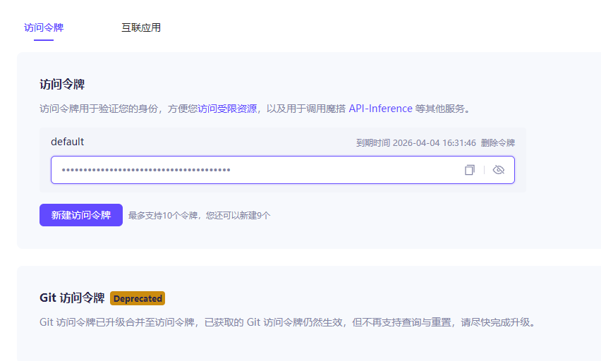
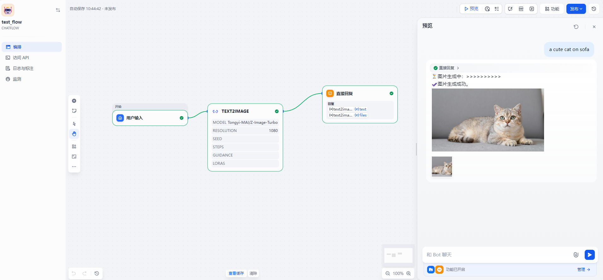
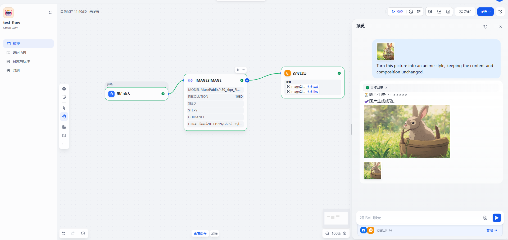

# ModelScope-Image

A Dify plugin based on ModelScope API‑Inference, providing text‑to‑image and image‑to‑image capabilities. It supports calling most AIGC models available on the ModelScope platform.

## Features

- **Multi‑model support**: Switch freely by specifying the model ID in the parameters. Supported models include `Tongyi-MAI/Z-Image-Turbo`、`MusePublic/489_ckpt_FLUX_1`、`Qwen/Qwen-Image-2512`, and many others from the ModelScope AIGC collection.
- **Text‑to‑image**: Generate images from text prompts. Supports positive/negative prompts, aspect ratio, resolution, seed, sampling steps, guidance scale, and LoRA models.
- **Image‑to‑image**: Use an uploaded image as a template and generate a new image guided by a text prompt. All parameters available in text‑to‑image are supported, plus an "original" aspect ratio option to preserve the input image’s proportions.
- **Comprehensive parameter tuning**:
  - **Aspect ratio**: 7 common ratios (1:1, 4:3, 3:4, 16:9, 9:16, 2:1, 1:2); image‑to‑image also offers an "original" option.
  - **Resolution**: Adjustable from 64 to 2048.
  - **Sampling steps**: 1–100 steps to balance quality and speed.
  - **Guidance scale**: 1.5–20 to control prompt influence.
  - **Random seed**: Fix a seed for reproducible results.
  - **LoRA models**: Specify compatible LoRA model IDs for style transfer or detail enhancement.

## Installation & Configuration

### 1. Get an API Key

You need a ModelScope API Key before using this plugin:

- Visit [ModelScope Access Token page](https://modelscope.cn/my/myaccesstoken)
- Log in to your account
- Create or copy your API key (usually starts with `ms-xxxxxx`)
  

### 2. Install the Plugin in Dify

Add the plugin to Dify’s plugin directory or install it via Dify’s plugin management interface.

### 3. Configure the API Key

Enter your ModelScope API Key in the plugin’s credential settings.

### 4. (For Image‑to‑Image Only) Environment Variable

If you use the image‑to‑image tool, you must set the following environment variable in Dify’s `.env` file to allow the plugin to access uploaded image files:

```bash
INTERNAL_FILES_URL=http://api:5001
```

This is required for internal container communication. Without it, the image‑to‑image tool may fail to retrieve the input image.


## Usage Examples

### 文生图

```
model: "Tongyi-MAI/Z-Image-Turbo"
prompt: "a cute cat on sofa"
aspect_ratio: "16:9"
resolution: 1080
```


### 图生图

```
model: "MusePublic/489_ckpt_FLUX_1"
prompt: Turn this picture into an anime style, keeping the content and composition unchanged."
image: [上传的图像文件]
aspect_ratio: "original"
resolution: 1080
loras: "liurui20111959/Ghibli_Style_2"
```


## Development

The plugin is written in Python and follows this structure:

```
ms-image/
├── manifest.yaml               # Plugin metadata
├── main.py                     # Plugin startup entry
├── provider/
│   ├── ms-image.yaml           # Provider configuration
│   └── ms-image.py             # Provider main logic
├── tools/
│   ├── text2image.yaml         # Text‑to‑image tool definition
│   ├── text2image.py           # Text‑to‑image implementation
│   ├── image2image.yaml        # Image‑to‑image tool definition
│   └── image2image.py          # Image‑to‑image implementation
└── icon.svg                    # Plugin icon
```

- **Python version**: 3.12
- **Supported architectures**: amd64, arm64

### Entry point

The plugin entry point is `main`, defined in `provider/ms-image.py`.

## Important Notes

- Ensure your API Key has sufficient permissions to call the selected models.
- For image‑to‑image, the input image should be in a common format (e.g., PNG, JPEG). Make sure the `INTERNAL_FILES_URL` environment variable is correctly set.
- Different models may support different parameter ranges or features. Refer to the official ModelScope documentation for model‑specific details.
- Check out [ModelScope AIGC models available for free](https://www.modelscope.cn/models?filter=inference_type&page=1&tabKey=task&tasks=hotTask:text-to-image-synthesis&type=tasks)。
## Privacy & License

- See [PRIVACY.md](./PRIVACY.md) for privacy information.
- This plugin is subject to the terms of use of the ModelScope API.

## Author

- **jinhaow**

## Version

Current version: `0.0.1`
